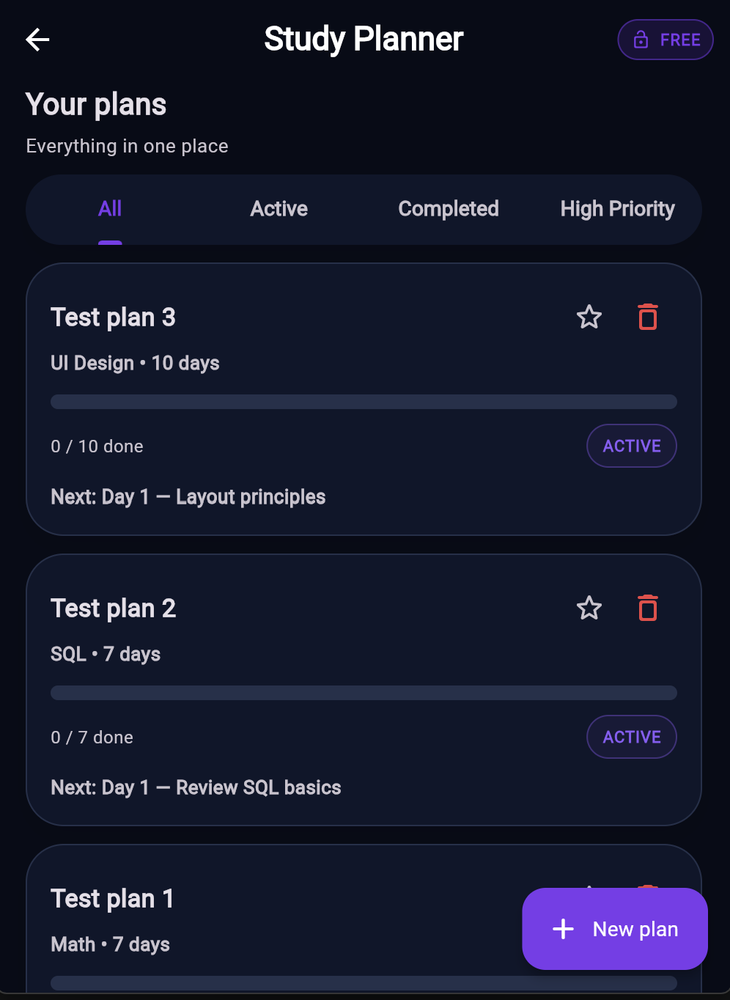
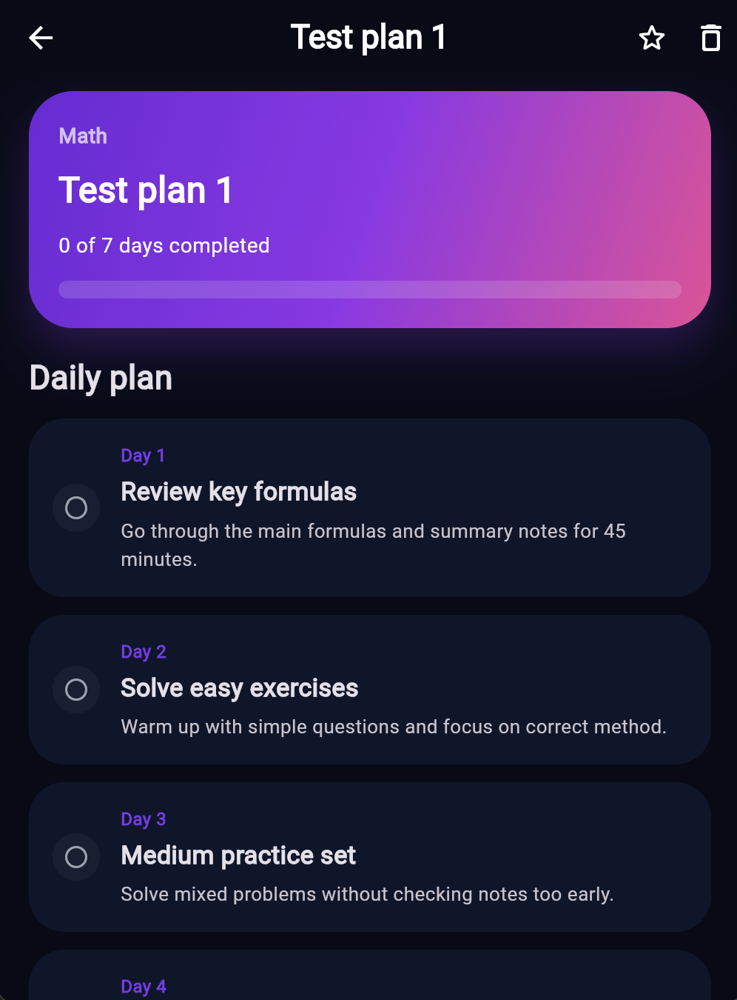

# StudyFlow

StudyFlow is a Flutter app for **planning coursework**, **tracking deadlines**, and **daily study progress** in a mobile-first student workflow. Domain: productivity and learning for mobile applications coursework (TAMK / THWS *Mobile Applications* module).

**Author:** Phan Ngoc Phuoc Loc · **Repository:** [github.com/Lockz178/studyflow-app](https://github.com/Lockz178/studyflow-app.git)

## Requirements checklist (course spec)

| Requirement | How it is met |
|-------------|----------------|
| Drawer or tab bar on first screen | **Drawer** on the dashboard |
| First screen: scrollable list | **Dashboard `ListView`** |
| Data from JSON assets / API | **`assets/data/studyflow_seed_data.json`** via `MockDataService` |
| Images (assets or URL) | Tips library uses **`Image.network`** (with icon fallback) |
| Custom list tiles (text + image/icon) | **`StudyPlanCard`**, **`StudyTipListTile`** |
| Detail screen | **`PlanDetailPage`** (`/plan/:id`) |
| Validated input, logic outside widget | **`study_plan_validator.dart`** (+ tests) |
| Light / dark theme | **Material 3** themes + Settings (**light / dark / device**) |
| State management | **`provider`** (`AppSettingsProvider`, `StudyFlowController`) |
| Layered architecture | **`models/`**, **`services/`**, **`providers/`**, **`screens/`**, **`widgets/`** |
| Loading / error / empty states | Dashboard seed load; tips feed |
| Named routes / router | **`go_router`** in `lib/router/app_router.dart` |
| **Shared preferences** | Theme, notifications, and **favourite plan IDs** |
| Tests | **`flutter test`**: model, validators, service, provider, widgets |
| Infinite scroll (bonus) | **`TipsLibraryScreen`** paginated tips |

## Flutter version

Use a current **stable Flutter** SDK that satisfies `pubspec.yaml` (`sdk: ^3.11.4`). Check with:

```bash
flutter --version
```

## Run the app

```bash
cd studyflow_app
flutter pub get
flutter run
```

Run tests:

```bash
flutter test
```

## Main packages

| Package | Why |
|---------|-----|
| **provider** | Course requirement for app-wide state (settings + study/dashboard state). |
| **go_router** | Declarative routes, deep links, `context.push` / `pop`. |
| **shared_preferences** | Persist theme mode, notification preference, and favourite plan IDs. |
| **url_launcher** | Opens the mail client for feedback (`mailto:`) and GitHub in an external browser. |

## Screenshots

| Dashboard (dark) | Study Planner | Plan Detail |
|---|---|---|
|  |  |  |

> Screenshots were captured on an Android emulator running API 34. Run the app with `flutter run` and take your own screenshots before submission if the images above are not yet committed.

## Project layout (high level)

- `lib/models/` — `StudyPlan`, `PlanItem`, events, templates  
- `lib/services/` — asset JSON loading, settings persistence  
- `lib/providers/` — UI state / orchestration  
- `lib/screens/` — full screens  
- `lib/widgets/` — reusable UI  
- `lib/router/` — route table  
- `lib/theme/` — shared `ThemeData`  
- `lib/validators/` — form validation helpers  
- `test/` — unit + widget tests  
